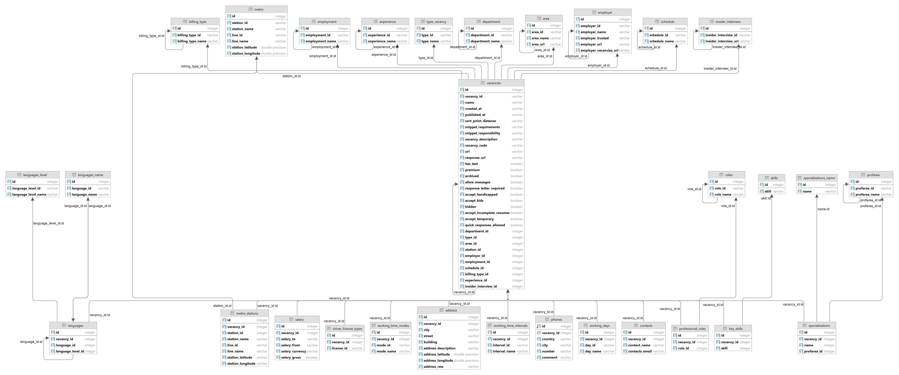
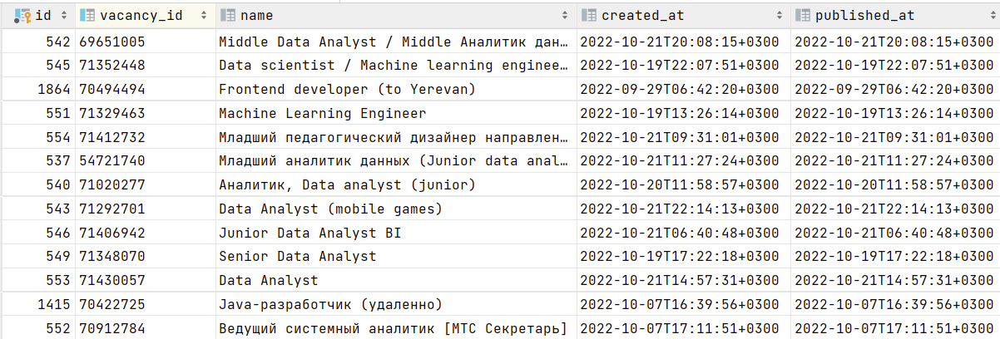
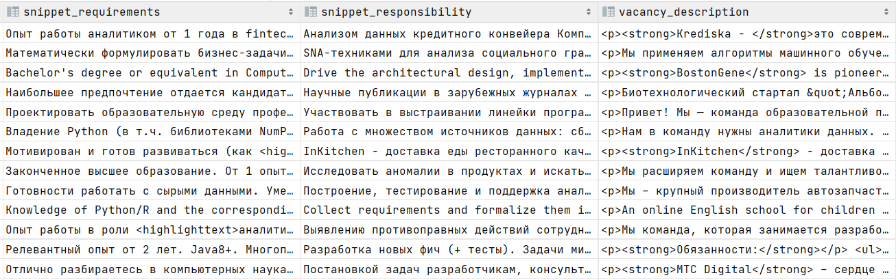
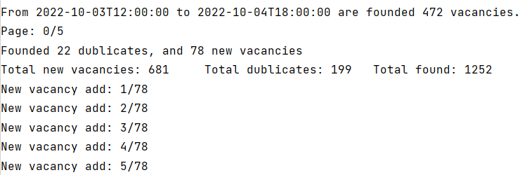

# VacanciesReviewer

Use [HeadHunterDatabaseDescription](./HeadHunterDatabaseDescription.py) to create a database using PostgreSQL to store information about vacancies

The database schema looks like this:

Example of the "Vacancies" table:
|   |   |
|---|---|
||   |

Use [HeadHunterVacancyDescription](./HeadHunterVacancyDescription.py) to create a class object that provides access to attributes containing information about the vacancy.

After creating the database, you can run a [HeadHunterCrawler](./HeadHunterCrawler.py) that will add vacancies to the database.
HeadHunter Crawler uses pagination by time. You can change the time interval as you like, however, for correct operation, it is worth considering the fact that the [HeadHunter API](https://github.com/hhru/api) gives out no more than 2000 vacancies. The smaller the time interval, the less likely it is to go beyond this limit.

Example of the HeadHunterCrawler operation:

